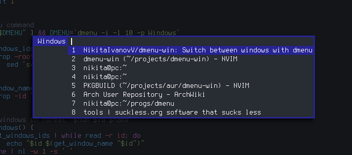

# dmenu-win

Switch between windows with dmenu



----

This small shell script allows you to quickly switch between windows with [dmenu](https://tools.suckless.org/dmenu/).

## Dependencies

* [dmenu](https://tools.suckless.org/dmenu/)
* [xprop](https://gitlab.freedesktop.org/xorg/app/xprop/)
* [xdotool](https://github.com/jordansissel/xdotool/)
* ([focusonnetactive patch](https://dwm.suckless.org/patches/focusonnetactive/), if you use [dwm](https://dwm.suckless.org/))

## Installation

### Manual

```sh
git clone https://github.com/NikitaIvanovV/dmenu-win
cd dmenu-win
sudo make install
```

Uninstall with `sudo make uninstall`

### AUR

If you are an Arch Linux user, you can install [`dmenu-win-git`](https://aur.archlinux.org/packages/dmenu-win-git/) AUR package.

```sh
yay -S dmenu-win-git
```

## Usage

Just run:

```sh
dmenu-win
```

dmenu is called with these options by default: `-i -l 10 -p Windows`. You can set your options by passing them as arguments to the script:

```sh
dmenu-win -l 5 -p Type...
```
